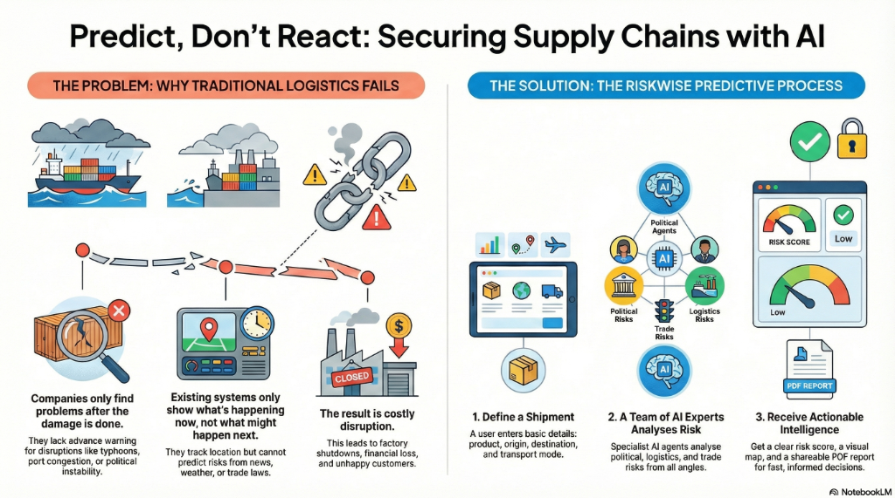
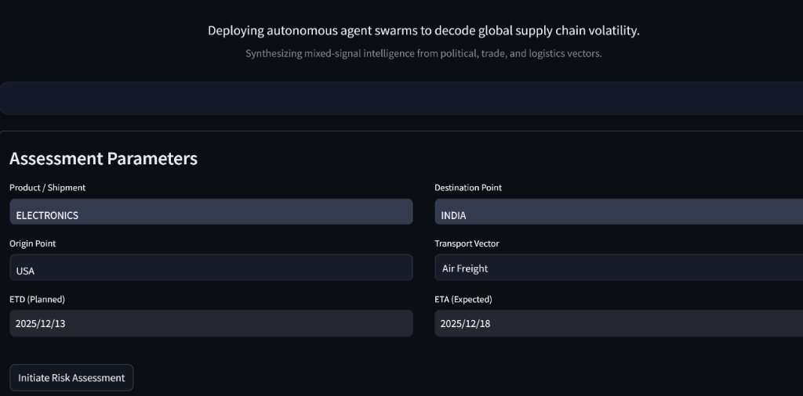
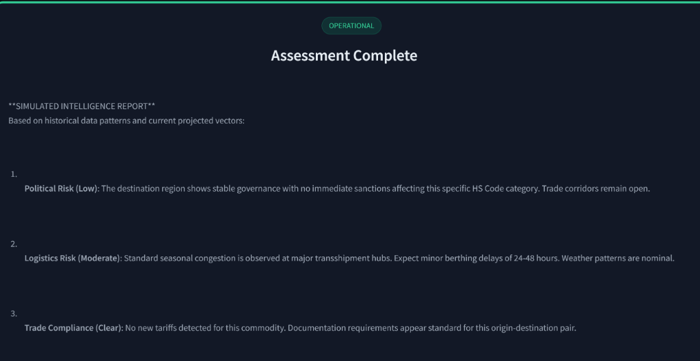
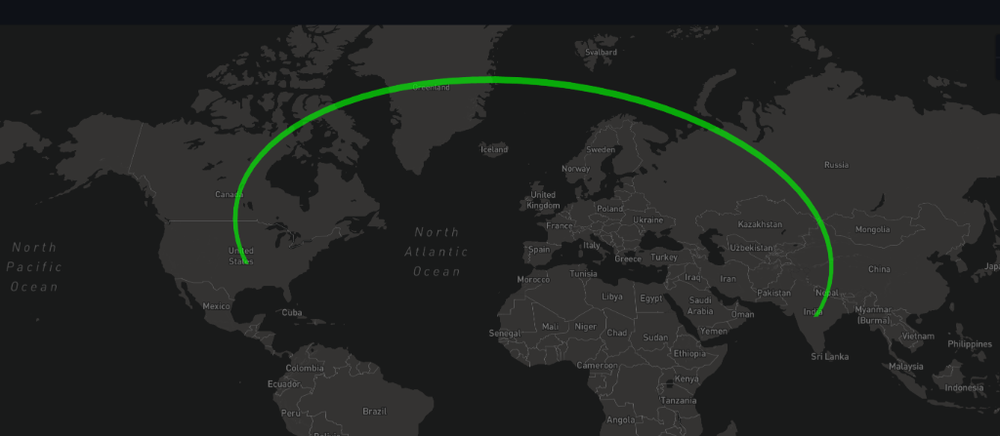
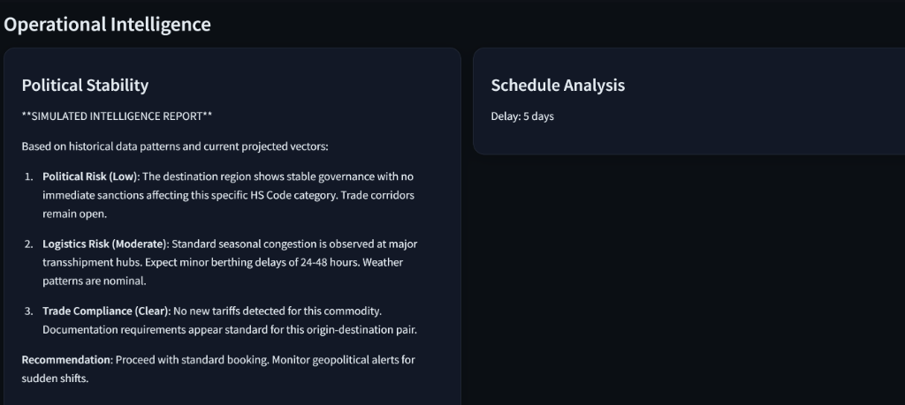
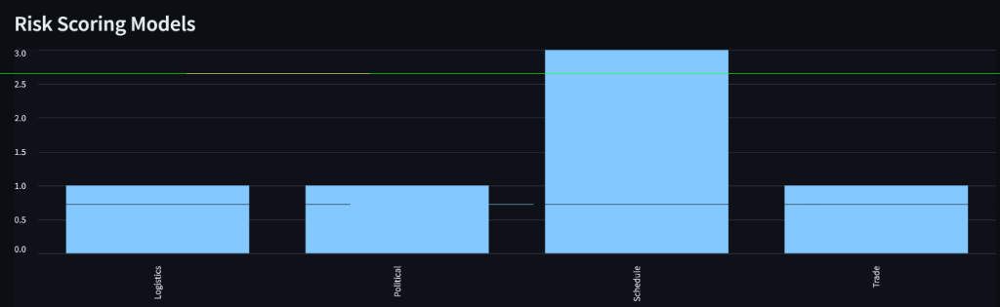
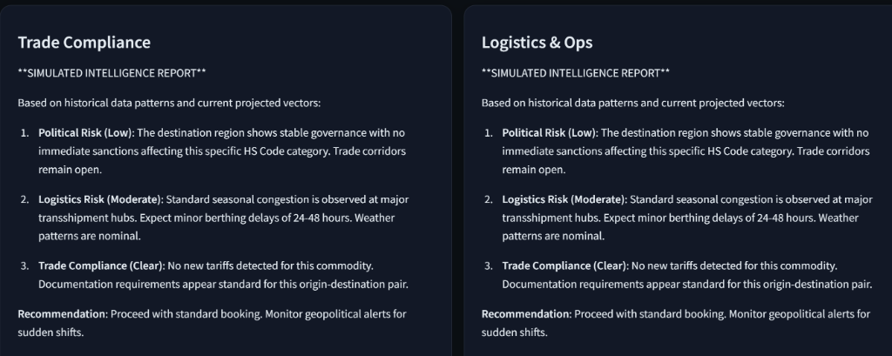
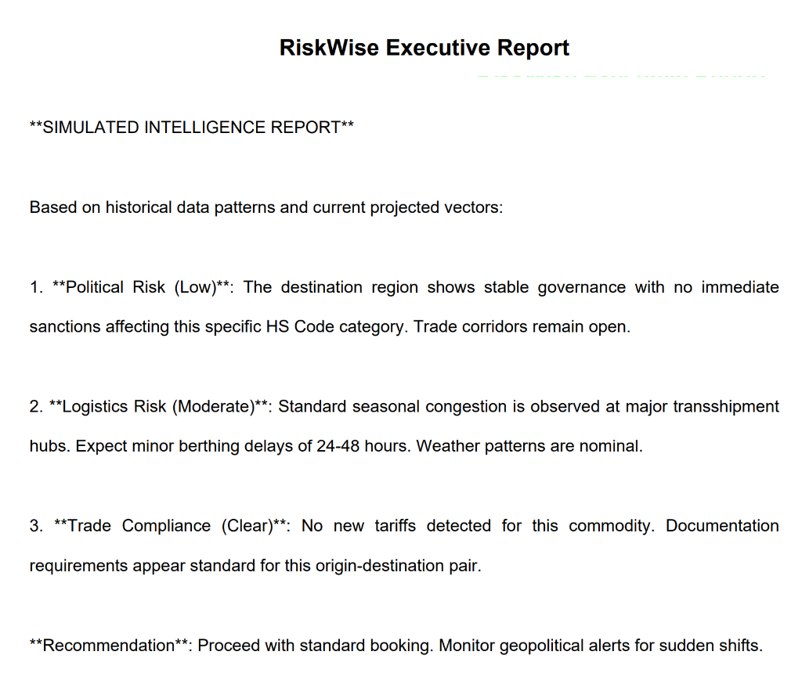

# 🌍 RiskWise AI

[](https://team---86-rnw5sqr6qkcfxcgpkdsfms.streamlit.app)
[](https://groq.com)

## 🚀 Run the Application Online

You can run the full **RiskWise Intelligence Platform** directly in your browser — no installation needed.

👉 **Try it on Streamlit Cloud:**
[https://team---86-rnw5sqr6qkcfxcgpkdsfms.streamlit.app](https://team---86-rnw5sqr6qkcfxcgpkdsfms.streamlit.app)

 

---

## 🚨 Problem Statement

**Global supply chains are breaking, and companies are flying blind.**

Today, logistics teams react to problems *after* they happen.
*   A ship gets stuck in port? **They find out 3 days later.**
*   A new tariff is announced? **They miss the news.**
*   A storm blocks a route? **Their goods are already stuck.**

This delay costs companies millions of dollars and causes major shortages (like chips or medicines) around the world. There is no simple tool that predicts these risks *before* they become disasters.



---

## 💡 Our Solution: RiskWise AI

**RiskWise is an intelligent "Command Center" for supply chains.**
It uses AI agents to watch everything—politics, weather, trade laws, and shipping routes—24/7.

Instead of just showing you a map, it acts like a team of expert analysts:
1.  **Predicts Delays** before they happen.
2.  **Reads News & Laws** instantly to find risks.
3.  **Scores Every Shipment** so you know exactly which ones are safe.

---

## 📸 Platform Preview

**RiskWise provides a complete "Command Center" view of your supply chain.**

**1. Define Assessment Parameters**
Enter critical shipment details (Origin, Destination, Mode) to wake up the agent swarm.


**2. Real-Time Risk Analysis**
The system synthesizes data into a unified risk report.


**3. Geo-Spatial Surveillance**
Visualizing the physical route vector and potential choke points.


**4. Detailed Intelligence & Scoring**
Breakdowns from the Political, Logistics, and Trade agents alongside quantitative scoring.

| Operatonal Agents | Risk Quantification |
| :---: | :---: |
|  |  |
|  | **Executive PDF Reports** <br>  |

---

## 🎥 Project Demo Video

This short video demonstrates the complete workflow of the RiskWise AI system.
It shows how a user enters shipment details, how the AI agents analyze risks,
and how the final risk report is generated.

Click the image below to watch the demo:

[](https://youtu.be/etLvSZD4GKo)

Note: The demo uses AI-generated narration and visuals for explanation.

---

## �️ How It Works

We built a **Multi-Agent System** where different AIs work together:

1.  **You Enter a Route**: e.g., "Semiconductors from Taiwan to Germany".
2.  **The Agents Wake Up**:
    *   🏛️ **Political Agent**: Checks for conflicts or sanctions.
    *   🚢 **Logistics Agent**: Checks for port jams or bad weather.
    *   📜 **Trade Agent**: Checks for new taxes or rules.
3.  **The System Thinks**: It combines all this data into one simple **Risk Score (0-20)**.
4.  **You Get Answers**: A full report explaining exactly *what* might go wrong and *why*.

---

## �💻 Tech Stack

*   **Brain**: Groq LPU (Ultra-fast AI inference)
*   **Logic**: Python & Multi-Agent Orchestrator
*   **Interface**: Streamlit (Custom "Dark Mode" Design)
*   **Map**: Pydeck (3D Geospatial Visualization)

---

## 🚀 How to Run Locally

If you want to test the code on your own machine:

1.  **Clone the Code**:
    ```bash
    git clone https://github.com/Ursmaax/TEAM---86.git
    cd TEAM---86
    ```

2.  **Install Python Libraries**:
    ```bash
    pip install -r requirements.txt
    ```

3.  **Run the App**:
    ```bash
    streamlit run riskwise/app.py
    ```

---

## ❓ Frequently Asked Questions (FAQ)

**1. How is this different from existing tools?**
Most tools track shipments *physically* (GPS). RiskWise tracks *volatility* (Politics, Laws, Weather). We tell you "Why" a delay will happen before the ship even leaves.

**2. What data sources does it use?**
It aggregates real-time data from news outlets, maritime weather stations, government trade registries, and port authority APIs, processing them via the Groq LPU.

**3. Can it work for any route?**
Yes! We support global coordinates (Asia, Europe, Americas, Middle East). Just enter any Origin and Destination city.

**4. What is the "Risk Score"?**
It's a composite metric (0-100). 0-20 is Safe, 21-50 is Moderate, and 75+ is Critical. It combines scores from Political, Logistics, and Trade agents.

**5. Why use Groq?**
Supply chain risks change in seconds. Groq's LPU allows our agents to read thousands of data points and reason in milliseconds, providing real-time intelligence.

---

## 👥 Team 86

*   **[Your Name]** - Project Lead
*   **[Member Name]** - Developer
*   **[Member Name]** - Researcher
*   **[Member Name]** - Designer

*Submitted for JNTUGV GenAI Hackathon 2025.*
